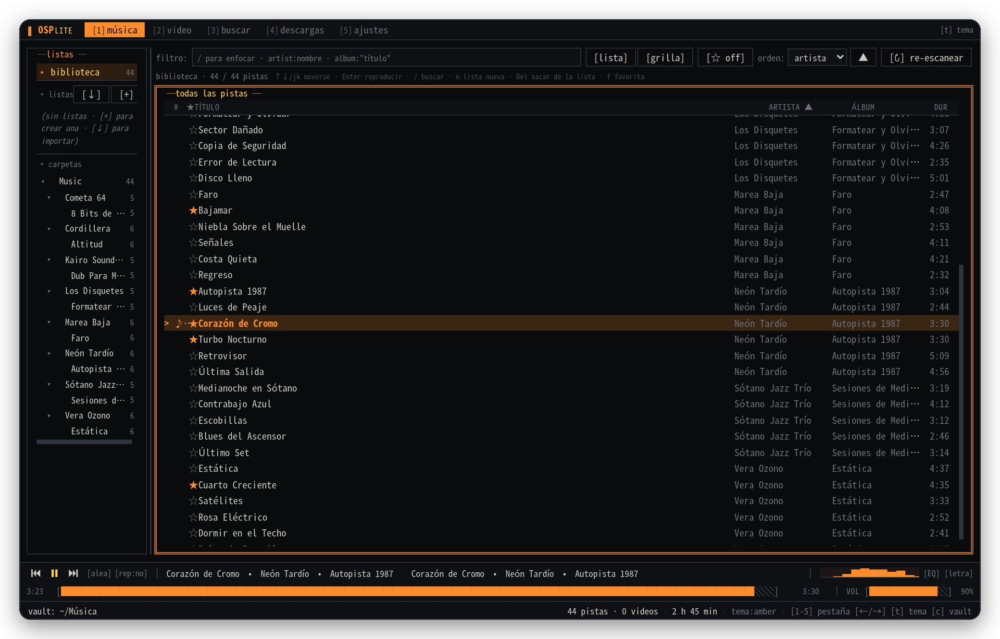
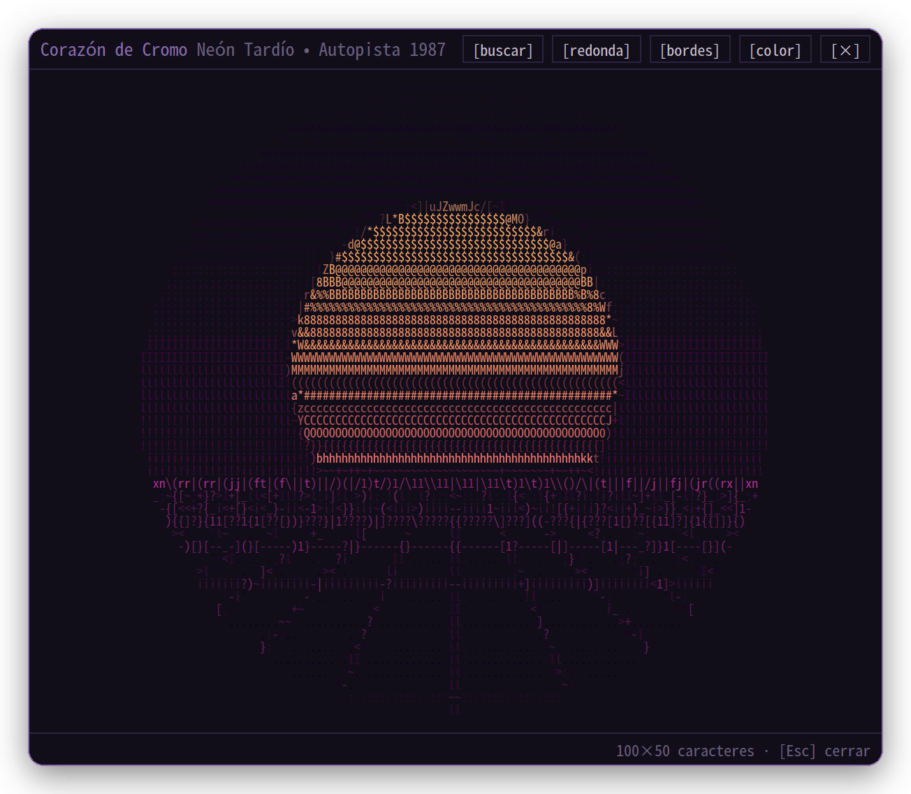
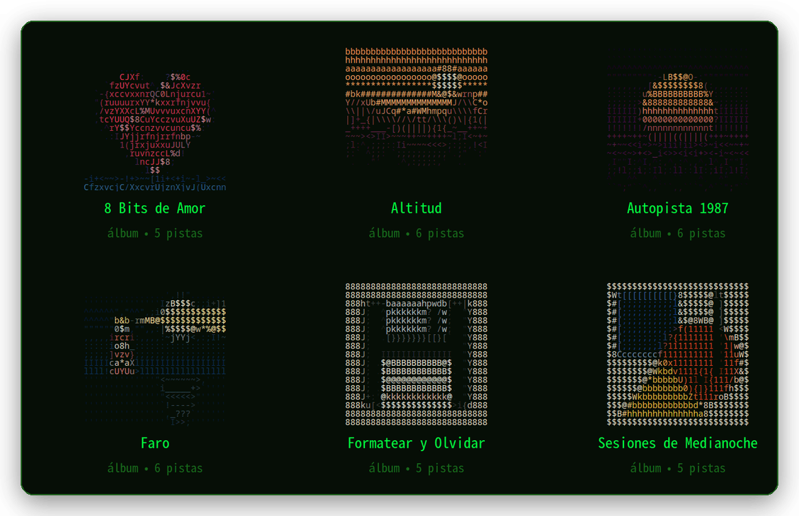
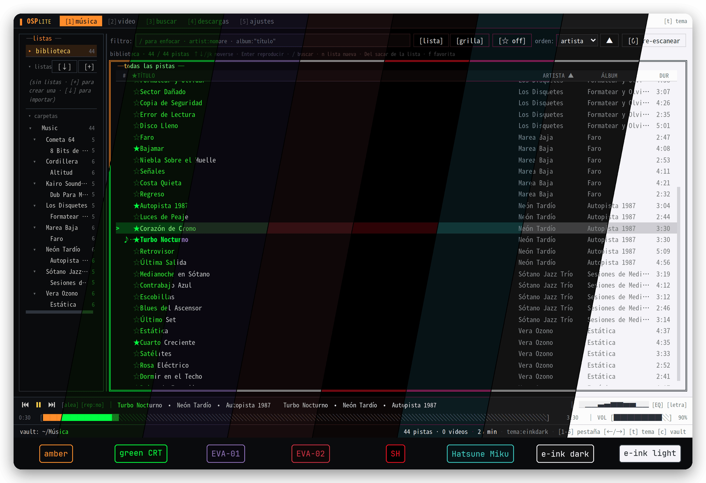
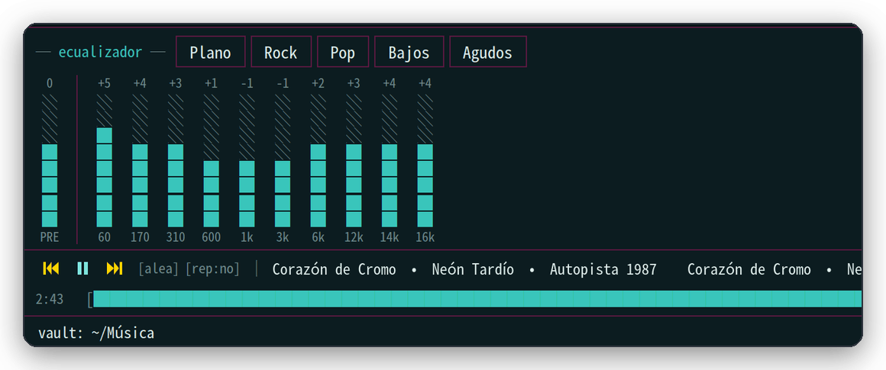
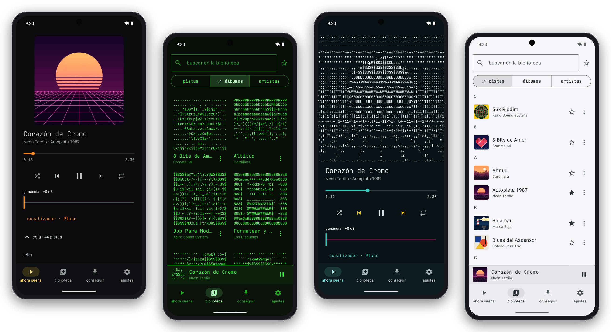
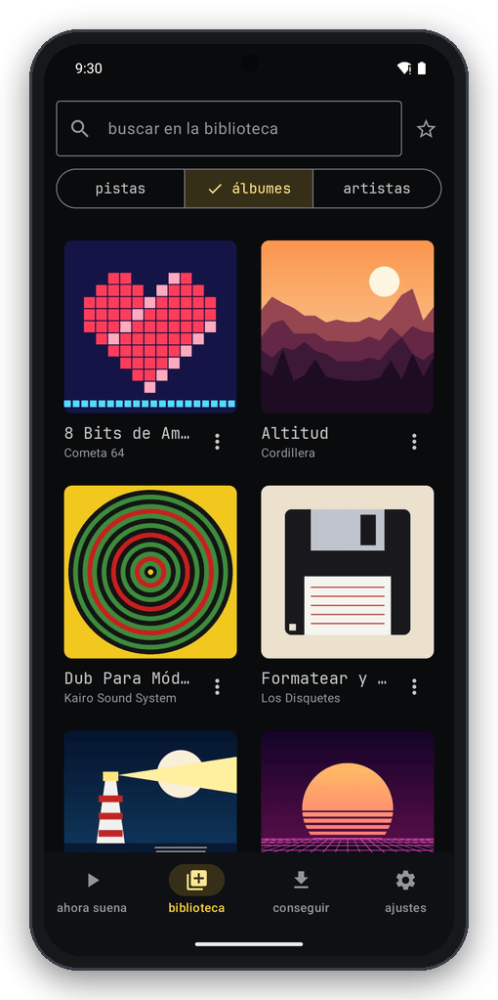
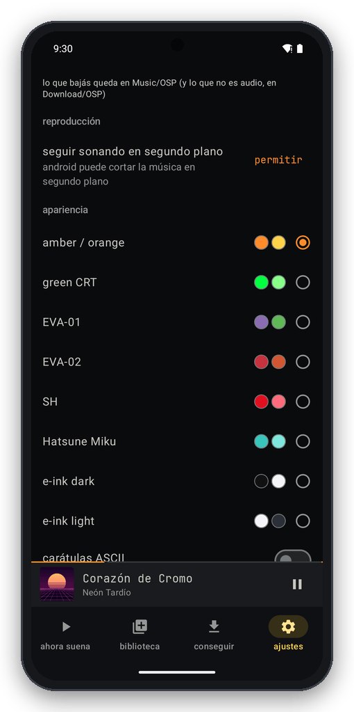
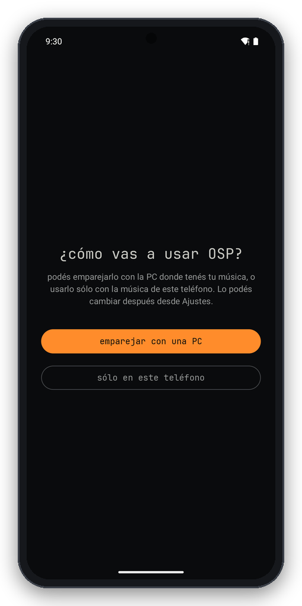

<div align="center">



### Tu música, en tu compu, con la estética de una terminal de los 80.

Carátulas dibujadas con caracteres, ocho temas de fósforo y de e‑ink, YouTube y torrents a un click,
y un teléfono que hace de control remoto… o se las arregla solo, sin PC.

<!-- OSP:INSIGNIAS:INICIO — generado por scripts/pagina-publica.mjs en cada release: NO editar a mano -->

<a href="#descargar"></a>
<a href="#descargar"></a>

<!-- OSP:INSIGNIAS:FIN -->


**[Descargar](#descargar)** · **[Qué tiene](#qué-tiene)** · **[El teléfono](#el-teléfono)** · **[Instalar](#instalar)** · **[Preguntas](#preguntas)**

<br>



<sub>Todas las capturas usan una biblioteca de demostración: artistas, discos y carátulas inventados para esta página.</sub>

</div>

<br>

## Descargar

<!-- OSP:DESCARGAS:INICIO — generado por scripts/pagina-publica.mjs en cada release: NO editar a mano -->

**Escritorio 0.4.10** · publicado el 8 de octubre de 2026  ·  **Android 0.8.3** · publicado el 5 de octubre de 2026

| Para | Bajá | Pesa | Cómo |
|---|---|---|---|
| 🪟 **Windows** 10 / 11 | [⬇ **Setup.exe**](https://github.com/AlvarezLaion/osp-lite-releases/releases/download/escritorio-v0.4.10/OldSchool-Player-Lite-0.4.10-Setup.exe "OldSchool-Player-Lite-0.4.10-Setup.exe") | 93 MB | doble click y listo, no pide administrador |
| 🐧 **Linux**, cualquier distro | [⬇ **.AppImage**](https://github.com/AlvarezLaion/osp-lite-releases/releases/download/escritorio-v0.4.10/OldSchool-Player-Lite-0.4.10.AppImage "OldSchool-Player-Lite-0.4.10.AppImage") | 123 MB | `chmod +x` y abrir, sin instalar nada |
| 🐧 **Debian · Ubuntu · Mint** | [⬇ **.deb**](https://github.com/AlvarezLaion/osp-lite-releases/releases/download/escritorio-v0.4.10/OldSchool-Player-Lite-0.4.10.deb "OldSchool-Player-Lite-0.4.10.deb") | 82 MB | doble click, o `sudo apt install ./archivo.deb` |
| 🐧 **Arch · Manjaro · EndeavourOS** | [⬇ **.pacman**](https://github.com/AlvarezLaion/osp-lite-releases/releases/download/escritorio-v0.4.10/OldSchool-Player-Lite-0.4.10.pacman "OldSchool-Player-Lite-0.4.10.pacman") | 83 MB | `sudo pacman -U archivo.pacman` |
| 🤖 **Android** 8 o más nuevo | [⬇ **osp-lite.apk**](https://github.com/AlvarezLaion/osp-lite-releases/releases/latest/download/osp-lite.apk "osp-lite.apk 0.8.3") | 29 MB | teléfonos de 64 bits (casi todos los de los últimos años) |

<!-- OSP:DESCARGAS:FIN -->

> [!TIP]
> **Instalás una vez y listo.** El escritorio te avisa cuando sale una versión nueva y se actualiza con un click;
> en el teléfono, cuando no está emparejado con una PC, la app te ofrece la nueva al abrirla. Instalar una
> versión encima de otra **no borra nada**: ni la música, ni las listas, ni lo que bajaste.

Las versiones anteriores están en [todas las releases](https://github.com/AlvarezLaion/osp-lite-releases/releases).
No hay versión para Mac ni app para iPhone (ver [preguntas](#preguntas)).

<br>

## Qué tiene

<table>
<tr>
<td width="50%" valign="top">

### ▸ Carátulas en ASCII
Cada carátula, dibujada con caracteres: en color o en el color del tema, redonda o cuadrada, con bordes o sin.
Un click sobre lo que suena y aparece en grande.

</td>
<td width="50%" valign="top">

### ▸ Tu biblioteca, como en una terminal
Carpetas, artistas, discos y listas en paneles de caja, todo con el teclado (`↑↓` o `j k`, `/` para filtrar,
`1`–`5` para las pestañas) o con el mouse. Pasá el mouse por el logo para ver todos los atajos. Y el logo
esconde algo más.

</td>
</tr>
<tr>
<td valign="top"></td>
<td valign="top"></td>
</tr>
</table>

### ▸ Ocho temas, una tecla



Ámbar de monitor viejo, verde de fósforo, los dos EVA, SH, Hatsune Miku y dos de e‑ink, uno oscuro y uno claro.
La tecla **`t`** los recorre, y el teléfono tiene los mismos.

<table>
<tr>
<td width="50%" valign="top">

### ▸ Buscar y bajar
Una sola búsqueda mira **tu biblioteca, YouTube y torrents** a la vez. De YouTube baja el audio (m4a o mp3);
los torrents se pueden escuchar **mientras bajan**, se pegan como magnet y siguen compartiendo al terminar.
Lo que bajás queda en tu carpeta de música.

El que baja de YouTube (yt‑dlp) **se actualiza solo**, que es lo que casi siempre rompe estas cosas.

</td>
<td width="50%" valign="top">

### ▸ Ecualizador
Diez bandas con ganancia de entrada y cinco preajustes, dibujado con bloques como todo lo demás.



</td>
</tr>
</table>

Y además:

- ★ **Favoritas que viajan.** Marcás una en el teléfono y aparece marcada en la PC, y al revés, aunque el
  teléfono esté sin conexión cuando la marcás.
- **Listas para compartir.** Una lista se exporta como texto o como archivo `.ospl`; quien la recibe ve cuáles
  tiene y cuáles no, y puede **bajar las que le faltan** con un click. Sin cuentas ni servidores.
- **La letra de lo que suena**, de [LRCLIB](https://lrclib.net).
- **Video también**, con los subtítulos `.srt` o `.vtt` que estén al lado del archivo.
- **En cuatro idiomas:** español rioplatense, English, français y 日本語.
- **Las teclas multimedia** del teclado y los controles del sistema funcionan aunque la ventana no esté a la vista.

<br>

## El teléfono

<div align="center">

</div>

La primera vez que la abrís, la app pregunta **cómo la vas a usar**:

<table>
<tr>
<td width="50%" valign="top">

#### 🖥️ Con tu PC

Se empareja una vez, escaneando un QR, y después:

- **Control remoto** de lo que suena en la PC.
- **O que suene en el teléfono**, con la música de la PC, sin copiar nada.
- **Bajar al teléfono** lo que quieras para escucharlo sin conexión.
- **Fuera de casa también**, si las dos están en la misma [Tailscale](https://tailscale.com).

</td>
<td width="50%" valign="top">

#### 📱 Sólo en este teléfono

No hace falta ninguna PC:

- Reproduce **la música que ya tenés en el teléfono**.
- La pestaña **conseguir** busca en **YouTube y torrents** y baja directo al teléfono.
- Se actualiza sola desde esta página.

</td>
</tr>
</table>

En los dos modos: los mismos ocho temas, carátulas en ASCII si las querés, favoritas, cola, ecualizador,
letra y los cuatro idiomas.

**¿iPhone o iPad?** No hay app, pero con el servidor prendido la PC sirve dos páginas web que se abren desde
Safari (o cualquier navegador): un **reproductor** que suena en el dispositivo que la abre, y un **control
remoto** de lo que suena en la PC.

<br>

## Instalar

<details>
<summary><b>🪟 Windows</b></summary>

1. Bajá el `-Setup.exe` de la [tabla de arriba](#descargar) y abrilo. Se instala para tu usuario, sin pedir
   permisos de administrador.
2. Windows va a mostrar **"Windows protegió su PC"**: el instalador no está firmado (un certificado de firma
   cuesta caro). Tocá **Más información → Ejecutar de todas formas**.
3. Al abrir la app por primera vez, elegí la carpeta donde está (o va a estar) tu música.

Si vas a usar el teléfono: la app de la PC **tiene que quedar abierta**, y si el firewall de Windows
pregunta cuando prendés el servidor, dale permiso en **redes privadas** (si no, el teléfono no la encuentra).

> La versión de Windows es la menos probada de todas. Si algo no anda, avisá.

</details>

<details>
<summary><b>🐧 Linux</b></summary>

**Debian, Ubuntu, Mint y derivados:** el `.deb`. Doble click y "Instalar", o desde una terminal:

```bash
sudo apt install ./OldSchool-Player-Lite-*.deb
```

**Arch, Manjaro, EndeavourOS:** el `.pacman`, un paquete nativo. Queda en el menú de aplicaciones y se
desinstala con pacman. Depende de `gtk3`, `nss` y `alsa-lib`, que están en los repos oficiales.

```bash
sudo pacman -U OldSchool-Player-Lite-*.pacman
```

**Cualquier otra distro, o sin instalar nada:** el `.AppImage`.

```bash
chmod +x OldSchool-Player-Lite-*.AppImage
./OldSchool-Player-Lite-*.AppImage
```

Si el AppImage no abre, casi siempre falta FUSE 2: `libfuse2` en Debian/Ubuntu (`libfuse2t64` en Ubuntu
24.04), `fuse2` en Arch. Sin instalarlo, también se puede abrir con `--appimage-extract-and-run`.

</details>

<details>
<summary><b>🤖 Android</b></summary>

1. Desde el teléfono, bajá el **`osp-lite.apk`** de la [tabla de arriba](#descargar) y abrilo.
2. Android te va a pedir permiso para **instalar apps de este origen** (el navegador o el administrador de
   archivos): dáselo. Si Play Protect dice que no conoce la app, **Instalar de todos modos**: no está en la
   Play Store, nada más.
3. Al abrirla, elegí **emparejar con una PC** o **sólo en este teléfono**. Se puede cambiar después desde
   Ajustes.

Necesita Android 8 o más nuevo y un teléfono de 64 bits.

</details>

<details>
<summary><b>🔗 Emparejar el teléfono con la PC</b></summary>

1. En la PC: **Ajustes → móvil (vault server) → `[▶ encender]`**. Viene apagado.
2. Más abajo, en **dispositivos emparejados → `[+ emparejar dispositivo nuevo]`**. Aparece un QR.
3. En el teléfono: **emparejar con una PC** y escaneá el QR. Si la cámara no anda, el código se puede tipear.

El código sirve una sola vez y vence en cinco minutos. Cada teléfono queda con su propia credencial, y desde
la PC se puede desemparejar cualquiera cuando quieras.

</details>

<br>

## Preguntas

<details>
<summary><b>¿Cuesta algo? ¿Hay que crear una cuenta?</b></summary>

No y no. No hay cuentas, ni anuncios, ni suscripción, ni nube: tu música vive en una carpeta de tu compu y la
app la lee de ahí.

</details>

<details>
<summary><b>¿Qué sale de mi compu?</b></summary>

No hay telemetría: la app no manda nada sobre vos ni sobre lo que escuchás. Sale a internet sólo para lo que
le pedís: buscar y bajar (YouTube, índices de torrents), traer carátulas y fotos de artistas (Deezer, iTunes,
MusicBrainz), la letra (LRCLIB) y ver si hay versiones nuevas, de la app (acá mismo) y de yt‑dlp. Entre la PC y el teléfono
todo va por tu red, o por tu Tailscale.

</details>

<details>
<summary><b>¿Por qué Windows (o Android) dice que la app no es segura?</b></summary>

Porque no está firmada con un certificado de pago (Windows) ni publicada en la Play Store (Android). Es el
aviso que sale con cualquier programa que no pasó por esas tiendas. Bajala siempre de esta página.

</details>

<details>
<summary><b>Tengo el teléfono emparejado con mi PC: ¿cómo lo actualizo?</b></summary>

Emparejado, el teléfono busca actualizaciones en tu PC, y tu PC no tiene de dónde sacarlas. Así que, por
ahora, cuando salga una versión nueva bajá el `osp-lite.apk` de esta página e instalalo encima: **no se
pierde nada**, ni el emparejamiento ni lo que bajaste. En modo "sólo en este teléfono" la app te avisa sola.

</details>

<details>
<summary><b>¿Hay versión para Mac? ¿Y para iPhone?</b></summary>

Para Mac, no por ahora. Para iPhone y iPad no hay app, pero la PC sirve un reproductor web que se abre desde
Safari (ver [El teléfono](#el-teléfono)).

</details>

<details>
<summary><b>¿Dónde está el código?</b></summary>

Este repositorio sólo publica los instaladores: el código no está acá. Las releases guardan también lo que
leen las apps para saber si hay una versión nueva.

</details>

<br>

<div align="center">

&nbsp;&nbsp;&nbsp;&nbsp;

<br>

<sub>Bajá sólo lo que tengas derecho a bajar. · <code>&gt;_</code> OldSchool Player Lite</sub>

</div>
